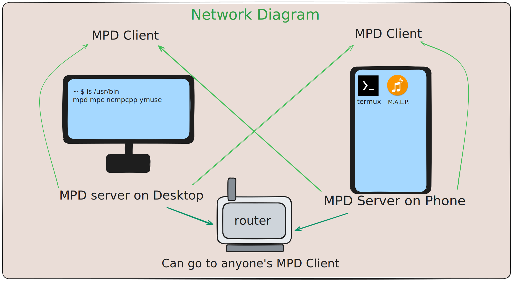

# Selfhost your Music

## The Problem

It's a well known fact that these days music
service providers are downright horrendous.
There is a number of issues:
- Unavailability:
    - Removed tracks
    - Unreleased tracks
    - User perserved tracks
    - Regional lockdowns
- Low Quality
- Poor library control
- And the obvious privacy invasions...
For free users it gets even worse:
- Playback restrictions
- Ads and interuptions
- Access restrictions
- Lack of integrations
- Constant nagging

## The Solution

Selfhost your music to take control, and
finally achieve good user experience:
- *Download your music*, with [spotdl](https://github.com/spotDL/spotify-downloader)
- *Host a music server*, with [mpd](https://github.com/MusicPlayerDaemon/MPD)
- *Connect using a client app*, with [mlpd](https://gitlab.com/gateship-one/malp) or [ymuse](https://github.com/yktoo/ymuse)
- Or don't even use a client app, connect to a *http stream* with [VLC](https://code.videolan.org/videolan/vlc)

(drawn with [Excalidraw](https://excalidraw.com/))

When you are away from your home network or 
it's simply unreachable, run your a **mpd**
directly on your phone.

## Supports

Operating Systems:
- Mobile:
    - Android
    - iOS
- Desktop:
    - Linux
    - MacOS
    - BSD
    - Windows with WSL
